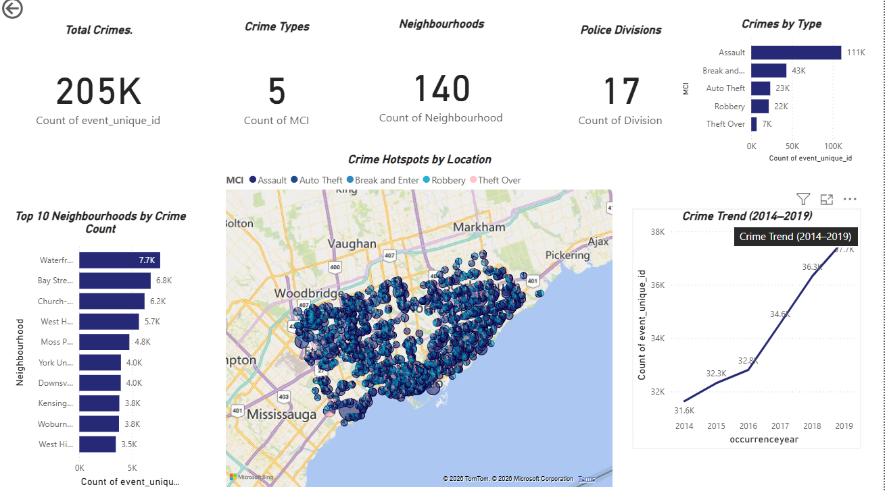

# Predictive Policing Analytics Dashboard

## Project Overview
This project analyzes historical crime data from the Toronto Police Service to identify crime patterns, trends, and hotspots using data analytics and interactive dashboards.

## Objective
To support data-driven policing by analyzing crime incidents, identifying high-crime areas, and visualizing trends that can help improve public safety and resource allocation.

## Tools & Technologies
- Power BI
- Python
- Jupyter Notebook
- Pandas
- NumPy
- Matplotlib

## Dashboard Highlights
- Total Crime Incidents
- Crime Type Distribution
- Crime Trend Analysis (2014–2019)
- Top 10 Neighbourhoods by Crime Count
- Crime Hotspot Map using Geographic Coordinates

## Key Insights
- Identified the most frequent crime categories.
- Analyzed yearly crime trends.
- Identified neighbourhoods with the highest crime rates.
- Visualized crime hotspots using latitude and longitude.

## Repository Structure
- Dashboard – Power BI dashboard (.pbix)
- Notebook – Python analysis notebooks
- Dataset – Crime dataset
- Images – Dashboard screenshots
## Dashboard Preview

